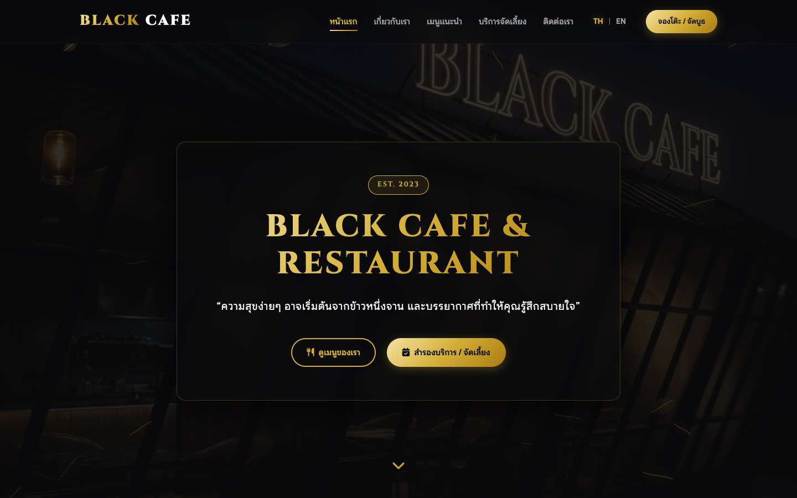
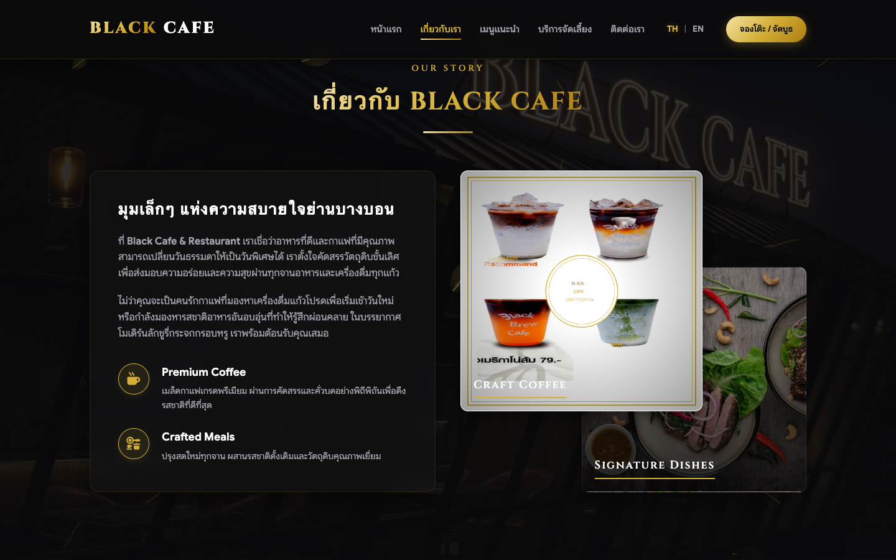
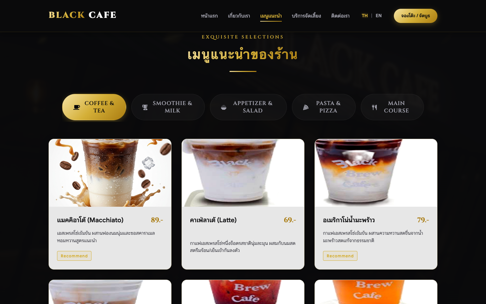
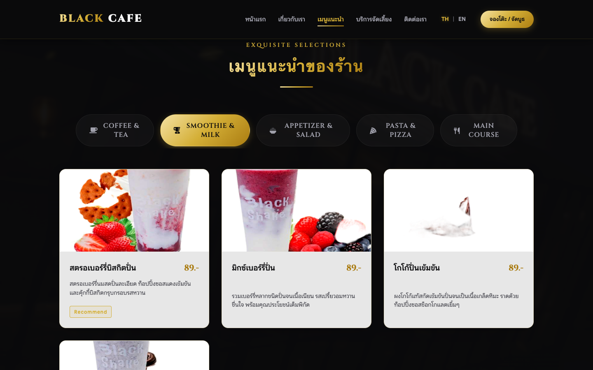
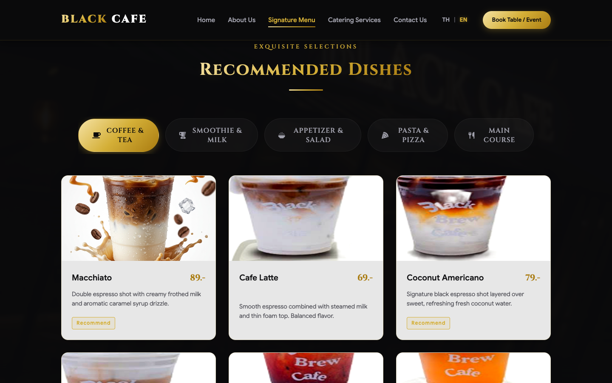
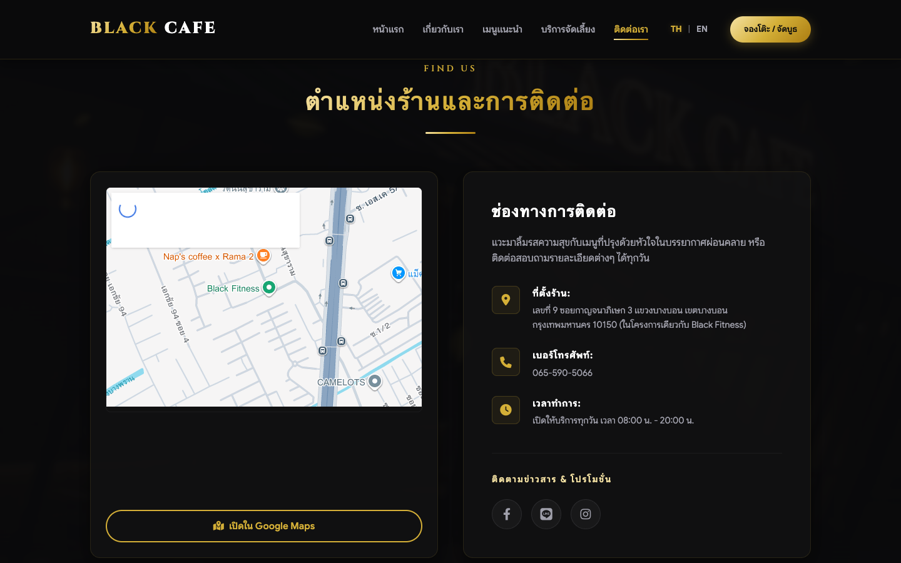
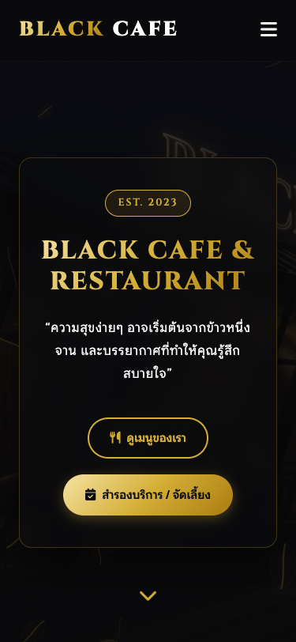
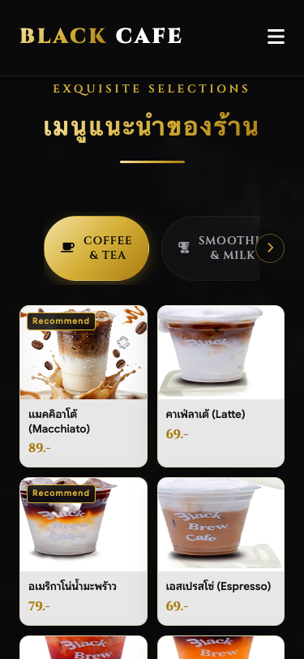
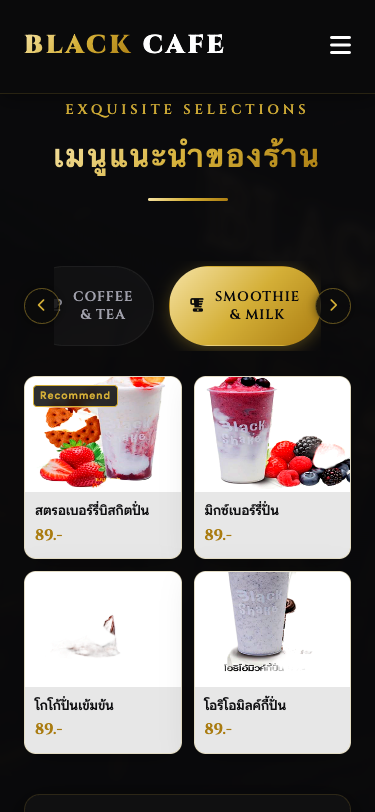
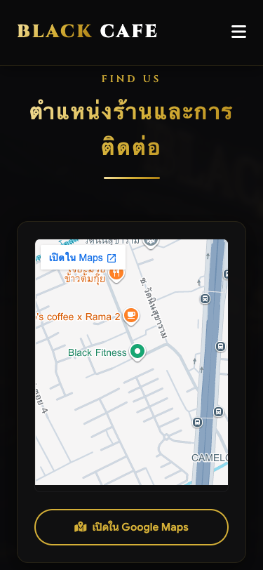

# Black Cafe & Restaurant ☕️✨ (Bang Bon / Kanchanaphisek 3)

ยินดีต้อนรับสู่โปรเจกต์พัฒนาเว็บไซต์ออฟฟิเชียลของ **Black Cafe & Restaurant** (สาขาบางบอน / กาญจนาภิเษก 3) ในสไตล์ **Premium Glassmorphism** (กระจกฝ้าหรูหรา) สวยงาม ทันสมัย และเป็นมืออาชีพสูงสุด รองรับการแสดงผลทุกหน้าจออย่างสมบูรณ์แบบ (100% Responsive)

---

## 🎨 จุดเด่นและฟังก์ชันการใช้งาน (Key Features)

### 1. การออกแบบระดับพรีเมียม (Premium Glassmorphic Design)
* ดีไซน์สไตล์กระจกฝ้าหรูหราซ้อนทับกันเป็นเลเยอร์ เพิ่มมิติลึกตื้น (Depth of Field) 
* คุมโทนสีทองเมทัลลิกไล่ระดับสี (`linear-gradient`) และสีดำลักชูรี 
* แอนิเมชันเมล็ดกาแฟลอยละล่องผ่านหน้าอาคารสร้างเอฟเฟกต์ 3D Parallax

### 2. ระบบสลับภาษา ไทย-อังกฤษ (Dual-Language TH/EN Switcher)
* รองรับภาษาไทยและภาษาอังกฤษครอบคลุม 100% ทั้งในส่วนคำอธิบาย เมนูอาหาร 60+ รายการ และช่องกรอกข้อมูลในแบบฟอร์ม
* ใช้ระบบ **Translation Dictionary** ในตัว โหลดข้อมูลทันใจไม่สะดุด
* บันทึกตัวเลือกภาษาล่าสุดของลูกค้าไว้บนเบราว์เซอร์ผ่าน `localStorage` เมื่อกลับมาเปิดใหม่จะแสดงผลเป็นภาษาล่าสุดเสมอ

### 3. ระบบแสดงผลรองรับมือถือและคอมพิวเตอร์ (Fully Responsive Layout)
* **PC & Desktop:** แสดงผลตารางเมนูไฮไลท์ พร้อมรายละเอียดรูปภาพ และคำอธิบายครบถ้วน
* **Mobile / Smartphone:** จัดเลเยอร์ใหม่เป็นตารางกริด 2 คอลัมน์ที่กะทัดรัด รูปภาพอาหารเด่นชัดขึ้น ซ่อนคำอธิบายที่ยาวเกินไปเพื่อไม่ให้รกตา
* **ระบบเลื่อนแท็บมือถือ (Scrollable Tabs):** แถบเลือกหมวดหมู่เมนูบนมือถือเลื่อนซ้าย-ขวาได้อย่างสมูท พร้อมลูกศรบอกทิศทางนำทางที่จะซ่อน/แสดงตามขอบการเลื่อนอัตโนมัติ

### 4. ระบบฟังก์ชันอำนวยความสะดวกอื่นๆ
* ระบบ **Auto-Scroll to Top** เมื่อผู้ใช้กดโหลดซ้ำ (Refresh) หน้าเว็บจะเลื่อนกลับมาที่หน้าแรกด้านบนสุดเสมอ
* แบบฟอร์มการจองโต๊ะ (Reservation Form) และติดต่อร้านค้าใช้งานได้จริง

---

## 📸 แกลเลอรี่ภาพจำลองการใช้งานจริง (Mockups & Screenshots Gallery)

### 💻 คอมพิวเตอร์ (PC / Desktop Views)

| 📌 หน้าแรกและโปรโมชั่นแบนเนอร์ (Hero & About) |
|:---:|
|  |
| *ดีไซน์ต้อนรับด้วยเมล็ดกาแฟเคลื่อนไหวและปุ่มสลับภาษา TH/EN สีทองประกาย* |
|  |
| *แบนเนอร์โฆษณาแนะนำร้านแสนอบอุ่นในส่วนแนะนำตัว* |

| 📌 หน้ารายการเมนูแนะนำสไตล์พรีเมียม (Premium Menu Cards) |
|:---:|
|  |
| *เมนูแนะนำอย่าง Caramel Macchiato ที่สร้างผ่าน Prompt ระดับพรีเมียม พร้อมหยดน้ำเกาะแก้วและเอฟเฟกต์การสาด* |
|  |
| *หมวดหมู่สมูทตี้ปั่นในรูปแบบการ์ดกระจกฝ้าหรูหรา* |

| 📌 หน้าการแปลภาษาอังกฤษ (EN Version View) |
|:---:|
|  |
| *ระบบแปลข้อความภาษาอังกฤษไดนามิกสมบูรณ์แบบ ทั้งชื่อเมนู ราคา และปุ่มคำสั่ง* |

| 📌 ระบบการจองโต๊ะและช่องทางติดต่อ (Booking & Contacts) |
|:---:|
|  |
| *แบบฟอร์มการจองโต๊ะและรายละเอียดที่ตั้งแผนที่เชื่อมต่อไปยังร้าน* |

---

### 📱 โทรศัพท์มือถือ (Mobile / Responsive Views)

| 📌 หน้าแรกมือถือ (Mobile Hero) | 📌 เมนูบนมือถือ 2 คอลัมน์ (Mobile Menu) |
|:---:|:---:|
|  |  |
| *หน้าต้อนรับบนมือถือ กระชับ สวยงาม* | *ตาราง 2 คอลัมน์แสดงรูปภาพเมนูเด่นชัด ซ่อนเนื้อหารายละเอียดไม่ให้แน่นหน้าจอ* |

| 📌 เมนูแท็บแบบเลื่อนได้ (Scroll Tabs) | 📌 หน้าการจองบนมือถือ (Mobile Booking) |
|:---:|:---:|
|  |  |
| *แถบหมวดหมู่เลื่อนได้ และมีระบบลูกศรชี้นำทาง* | *แบบฟอร์มย่อขนาดเหมาะสำหรับการใช้นิ้วกดจองบนโทรศัพท์* |

---

## 🛠️ วิธีการติดตั้งและทดสอบภายในเครื่อง (Local Run Instructions)

1. ดาวน์โหลดโค้ดโครงการนี้ลงในเครื่องคอมพิวเตอร์ของคุณ
2. ดับเบิ้ลคลิกไฟล์ `index.html` เพื่อเปิดใช้งาน หรือจำลองการเปิดเซิร์ฟเวอร์ด้วยคำสั่ง:
   ```bash
   python3 -m http.server 8000
   ```
3. เปิดเว็บเบราว์เซอร์ไปที่ลิงก์: **http://localhost:8000** เพื่อเข้าชมหน้าร้านจำลองทันที

---

*Designed with ❤️ by Black Cafe & Restaurant*
